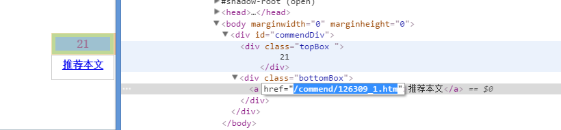

# HIT-spider

## 目录结构

- hitwlan.py 登陆HIT-WLAN的脚本(需要自己的账号密码..不是test)
- jwc.py 教务处上搞事情的脚本
  - 爬成绩
  - 爬照片
  - 选课，退课

- login.py 新版认证登录
- today.py 今日哈工大刷票

## 说明
学校的网站，可能发生变化，，所以这些东西都是有时效性的。

第一次登录可能会失败，原因不知，再跑一次就没有问题。还有，文化素质课是新设的，不确定可以。愿意测试的联系我。qq:519043202

大家可以给我发issue来提意见。。比如说想做个爬某个班的成绩，爬课表啥的。。

前段时间作者被查水表了。向教务处供出了选课bug，所以以后可能被修复....

### 选课说明

调用

```python
c.xuanke("2016-2017-2-13SD28002200-001","xx",'100')
```

第一个参数为课程编号，第二个参数为课程代码。参见楼下（就人文社科特别点..），第三个参数可有可无是用来投权重的。

课程有分两种，一种直接点选课的，一种要投权重的（权重其实没必要抢，现在也没条件测试。。so..

| 课程类型   | 代码   |
| ------ | ---- |
| 限选     | xx   |
| 创新实验   | cxsy |
| 体育     | ty   |
| 英语     | yy   |
| 人文社科限选 | tsk  |
| 创新研修   | cxyx |
| 素质限选   | szxx |
| 素质核心   | szhx |


有一些特殊的玩法，涉及一点不好的事，所以就不公开了，有意者私聊。比如说~~非选课时间选课~~。

退课时需要修改学期。比如说下面第四行的。代表2016-2017学年第二个学期。以此类推。

```python
# 第100行开始
data = {
  'rwh' : cid,
  'pageXklb' : lb,
  'pageXnxq':'2016-20172',
  'pageNj': '',
  'pageYxdm': '',
  'pageZydm': '',
  'pageKcmc': '',
}
```

## 刷票说明

taget传入  对应的url
shua的第一个参数为刷票的次数

成功次数不定。基本还是很好用的。

没有试过大量刷票，自重。。


## 详细说明

见我的博客，[正在编写ing..](http://tmn07.com/hexo)